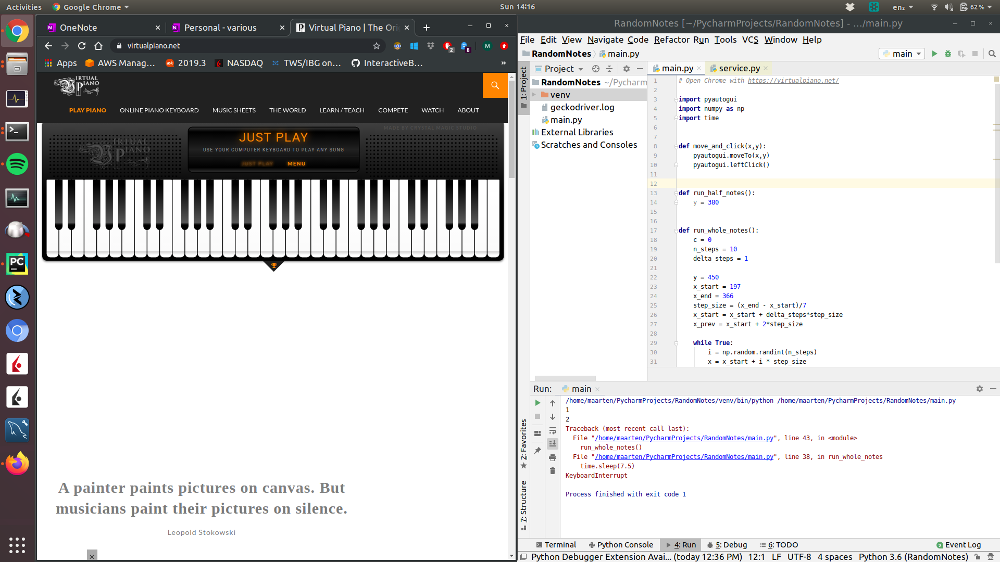
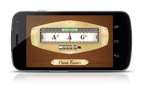

Code to practice singing on pitch. Use the code as follows. Have your screen layout set up as:

On a cell phone, open a chromatic tuner, that shows the tone you're singing (e.g. Pano tuner)

Run main.py, let it hit random notes, and reproduce them. See how accurate your pitch is on your mobile tuner.